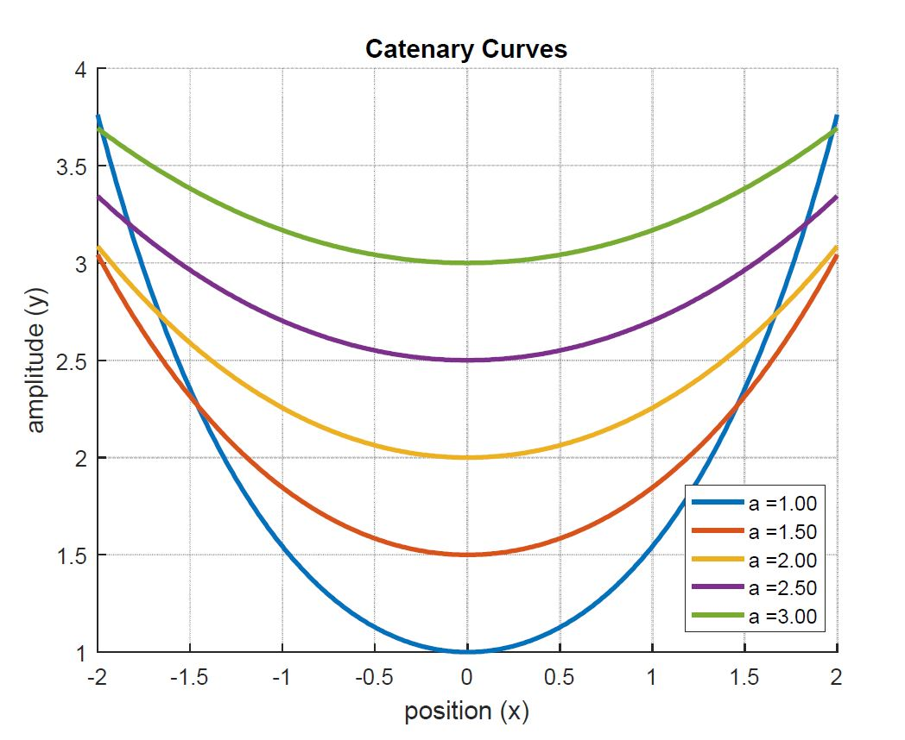

# catenary-curves

MATLAB Assignment for Engineering Skills 2 
Free Hanging Cable

A free hanging cable suspended from two fixed points takes the shape of a catenary curve.

The equation of a catenary curve is:

where cosh(β) is defined as:

a) Write a Matlab script file which will calculate the value of cosh(b) from first principles (i.e. do not use
the built in MATLAB cosh() function! However, you may use the factorial() function).

   Your script should:

   - Ask the user for the required level of precision.

   - Stop the calculation when that level is reached.

   - (i.e. when the difference between the nth term and the (n-1)th term is less than the required precision).

b) Once you have confirmed your script is giving you the correct answer, change your script so that it will
now plot a series of catenary curves for various values of a across a fixed range of x.

Your script should :

- Ask the user for a starting point, an end point and an increment for x.

- Ask the user for a starting point, an end point and an increment for a.

- Check to make sure you have valid entries for a (e.g. amin > 0, etc.).

- Display a graph with appropriate labels for the axes, title and curves. Example Ouput:

